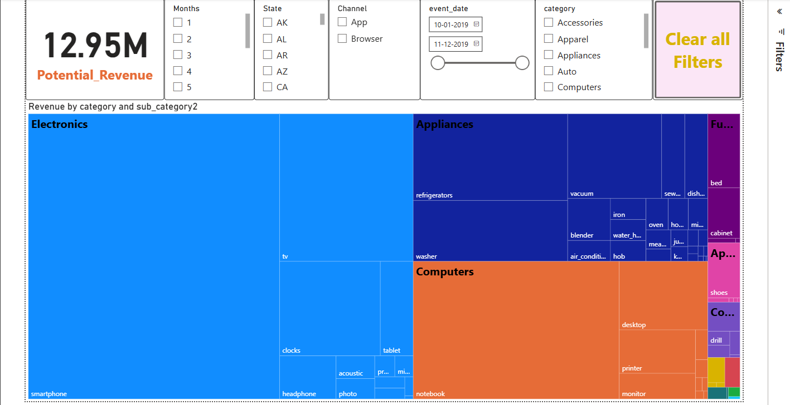

# Sales Analysis Dashboard (Excel)

## Project Overview
This project analyzes sales data using Microsoft Excel to identify revenue trends, top-performing products, customer segments, and regional performance.

## Tools Used
- Microsoft Excel
- Pivot Tables
- Pivot Charts
- Slicers
- Conditional Formatting
- Power Query (if used)
- XLOOKUP / INDEX-MATCH (if used)

## Dataset
- Number of Records: 12,000
- Columns: 18

## Key Insights
- North region generated the highest revenue.
- Electronics contributed 42% of total sales.
- Q4 had the highest profit.
- Repeat customers generated 63% of revenue.

## Dashboard Features
- Interactive slicers
- Monthly sales trend
- Region-wise sales
- Product category analysis
- KPI Cards

## Files
- Raw_Data.xlsx
- Cleaned_Data.xlsx
- Sales_Dashboard.xlsx

## Dashboard Preview

